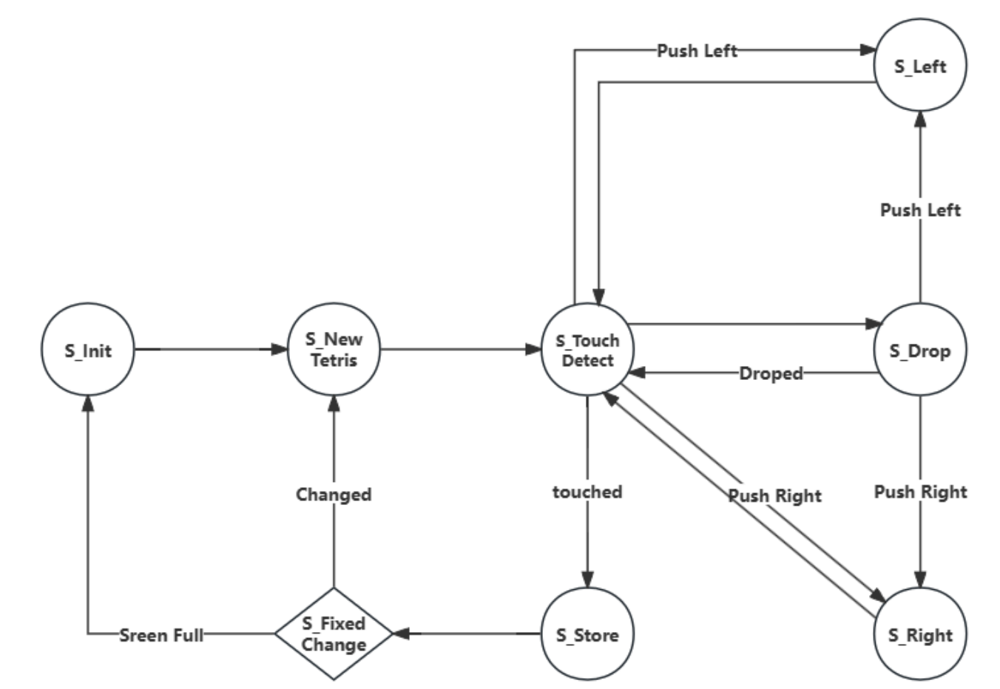

# **GateTris**

[English](README.md) | [简体中文](README_zh.md)

## **0. 项目情况简述**
本项目完全基于Verilog语言在Xilinx PYNQ-Z2开发板上实现，**不涉及Python脚本**，也**未调用ARM核功能**。

---

## **1. 效果演示**
PYNQ-Z2开发板通过Pmod VGA模块，将每个RGB通道的4位数字输出**经由简易DAC电路转换为模拟值**，并通过VGA接口连接显示器。使用开发板上的**四个轻触开关**输入控制信号。

### **1.1. 难度选择**
https://github.com/user-attachments/assets/14c16298-e1b9-41f9-9e08-8ee522572498

*   **通过将**初始页面的红色方块**移动至**下方不同色块处，**可触发页面跳转**。  
*   不同色块**对应不同难度**，每种难度下方块的**默认下落速度不同**。  

### **1.2. 移动、触底与新方块生成**
https://github.com/user-attachments/assets/4be1c13c-a48a-4076-9d2f-f7adf2b00db4

*   该片段展示了俄罗斯方块的核心玩法：**横向移动**与**加速下落**。  
*   当下落方块**碰撞**到底部或已有固定方块时，立即**转为固定状态**，并**随机生成新方块**。新方块将置于左上角的"**等待区**"，而原等待区中的方块将**进入操作区**转为可控下落方块。

### **1.3. 消除与计分**
https://github.com/user-attachments/assets/b9570b66-544e-4d57-bd6f-76ca60f7cb5d

*   当任意一层**被完全填满**时，该层将被**消除**，同时其上方的固定方块会**依次下落**，左下方的计分区将**动态更新**。 
 
---

## **2. 项目设计思路**
### **2.1. 状态机设计**

### **2.2. 控制逻辑设计**
通过三个数组实现核心功能：  
*   **移动数组(Moving Array)**：控制下落方块的渲染。由定时器驱动刷新，通过**将值重新分配至下一行**实现下落效果。  
*   **静止数组(Still Array)**：管理已固定方块的显示。  
*   **下一个数组(Next Array)**：控制等待区中方块的预览。  
    - 通过硬件随机数分配形状  
    - 定义并显示待下落方块  
    - 方块生成时将其值**转移至移动数组**  
    - 方块碰撞时将其值**迁移至静止数组**  
  
### **2.3. 显示逻辑设计**
VGA协议实现包含以下模块：  
#### **时序发生器**  
- **基准时钟输入**：生成目标分辨率所需的像素时钟（本项目为640x480@60Hz，需25MHz）  
- **同步计数器**：  
  - *水平方向*：总周期800（640显示区 + 前沿16 + 同步脉宽96 + 后沿48）  
  - *垂直方向*：总行数525（480显示区 + 前沿10 + 同步脉宽2 + 后沿33）  
- **同步信号**：  
  - `HSync`：低有效脉冲（同步脉宽96时钟周期）  
  - `VSync`：低有效脉冲（同步脉宽2行）  

#### **像素坐标生成器**  
- 根据计数器值计算`(X,Y)`坐标  
- **`显示使能信号(Display Enable)`**：在`0 ≤ X < 640`且`0 ≤ Y < 480`时有效  

#### **视频数据流水线**  
- 存储像素数据  
- 地址计算：`Y × 行宽 + X`  
- 当`显示使能信号`有效时输出RGB值 

完成上述基础控制逻辑后，**只需由显示模块实时读取**控制模块传入的**坐标映射像素值**，即可渲染游戏画面。

---

## **3. 项目特点**
*   **硬件并行处理**实现**实时碰撞检测**，精度达像素级。  
*   **基于时钟的随机数生成器**：  
    - 使用**高频计数器**，其时钟分频参数**与主时钟互质**  
    - 利用玩家操作的**时间随机性**近似真随机数  
    - **减少逻辑资源占用**（相比算法RNG），但牺牲能效  

### ⚠️ 学术诚信警告 {#academic-warning}
> 1. 本仓库为鲁汶大学 Digital Desing Concept 课程设计代码，已加入学校代码查重系统  
> 2. 采用AGPL-3.0协议：**直接复用需开源整个衍生工程**  
> 3. 未经授权用于课程作业将导致：  
>    - 代码被强制公开（AGPL传染条款）  
>    - 面临学术不端调查

